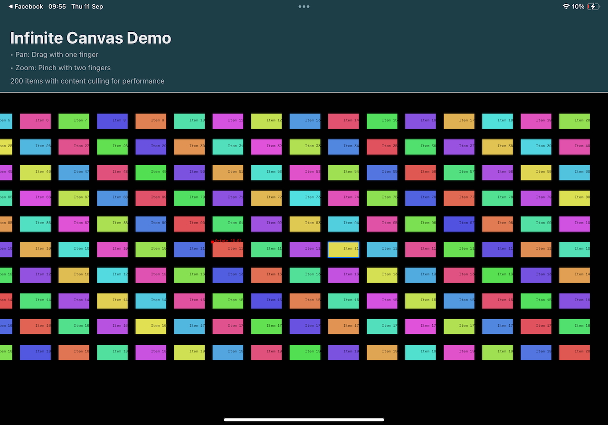

# React Native Skia Infinite Canvas Demo

A demonstration app showcasing how to build a high-performance infinite canvas using React Native Skia. This project implements the concepts covered in the blog post [Building an Infinite Canvas with Skia in React Native](https://robcost.com/building-an-infinite-canvas-with-skia-in-react-native/).



## Features

- **Infinite Canvas**: Pan and zoom smoothly across a boundless 2D space
- **Intuitive Gestures**: Smooth pan (one finger) and pinch-to-zoom (two fingers) with precise focal point tracking
- **Tap-to-Select**: Touch any item to select it with visual feedback (blue border)
- **Natural Momentum**: Pan gestures include smooth momentum physics for native feel
- **Transform Matrix**: Single matrix coordinate system for efficient rendering
- **Content Culling**: Performance optimization that renders only visible items
- **Hardware Acceleration**: Leverages Skia's GPU-accelerated graphics engine

## Demo Content

The app displays 200 colorful items distributed across the infinite canvas, demonstrating:
- Smooth 60fps performance with large datasets
- Efficient memory usage through viewport culling  
- Natural gesture handling with 1:1 finger tracking
- Precise focal-point zoom without drift
- Interactive item selection with visual feedback
- Momentum-based pan physics for native feel
- Origin reference point for spatial context

## Getting Started

1. **Install dependencies**
   ```bash
   npm install
   ```

2. **Start the development server**
   ```bash
   npm start
   ```

3. **Run on your preferred platform**
   - iOS Simulator: Press `i` in the terminal
   - Android Emulator: Press `a` in the terminal
   - Expo Go: Scan the QR code with your device

## Technical Implementation

This demo implements the core concepts from the blog post:

- **Single Transform Matrix**: All coordinate transformations managed through one matrix
- **Shared Values**: React Native Reanimated for smooth gesture physics
- **Content Culling**: Only renders items within the current viewport
- **Gesture Composition**: Simultaneous pan, zoom, and tap without interference
- **Coordinate Conversion**: Screen-to-world coordinate transformation for accurate hit testing
- **Visual Feedback**: Selected items highlighted with distinctive borders

## Key Technologies

- [React Native](https://reactnative.dev/) - Mobile app framework
- [@shopify/react-native-skia](https://shopify.github.io/react-native-skia/) - High-performance 2D graphics
- [react-native-reanimated](https://docs.swmansion.com/react-native-reanimated/) - Smooth animations and gestures
- [react-native-gesture-handler](https://docs.swmansion.com/react-native-gesture-handler/) - Native gesture recognition
- [Expo](https://expo.dev/) - Development platform and toolchain

## Related Resources

- **Blog Post**: [Building an Infinite Canvas with Skia in React Native](https://robcost.com/building-an-infinite-canvas-with-skia-in-react-native/)
- **Skia Documentation**: [React Native Skia Docs](https://shopify.github.io/react-native-skia/)
- **Reanimated Guide**: [Gesture Handling](https://docs.swmansion.com/react-native-reanimated/docs/fundamentals/glossary#gesture)

## License

This project is provided as an educational example to accompany the blog post.
